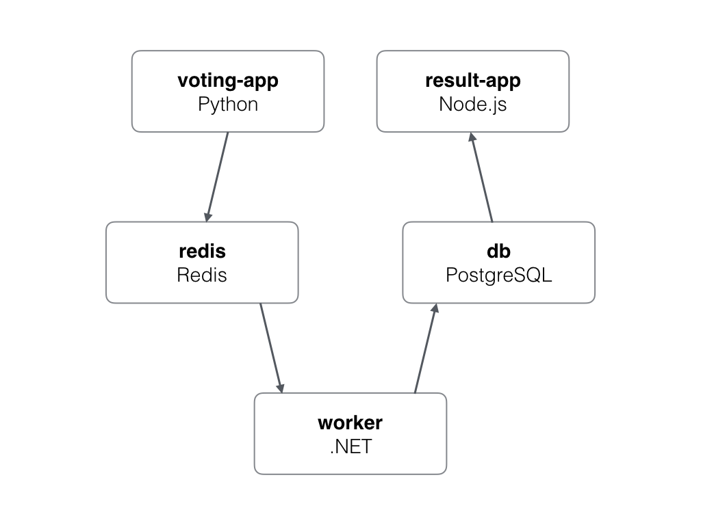

# Voting App Architecture

This voting app is designed with a microservices architecture, utilizing Docker containers for easy deployment and scalability. The application consists of three main components: `vote-app` (Python), `result-app` (Node.js), and `worker-app` (C#), connected through Redis and PostgreSQL databases.



## Prerequisites
Before running the application, make sure you have Docker installed on your system.

### Running Redis Container
```bash
docker run -d --name=redis redis
```
### Running PostgreSQL Container
This is not a secured approach, use username and password instead
```bash
docker run -d --name=db -e POSTGRES_HOST_AUTH_METHOD=trust postgres:9.4
```

### Running Vote App Container
This is not a secured approach, use username and password instead
```bash
docker run -d --name=vote -p 5000:80 --link redis:redis sanket01/voting-app-vote-app
```

### Running Result App Container
This is not a secured approach, use username and password instead
```bash
docker run -d --name=result -p 5001:80 --link db:db sanket01/voting-app-result-app
```

### Running Worker App Container
This is not a secured approach, use username and password instead
```bash
docker run -d --name=worker --link db:db --link redis:redis sanket01/voting-app-worker-app
```

### Accessing the Apps
Visit localhost:5000 to access the vote-app.
Visit localhost:5001 to access the result-app.

### Important Note
The usage of --link is not the recommended way for inter-container communication in Docker. For a production environment, consider using Docker networks instead.